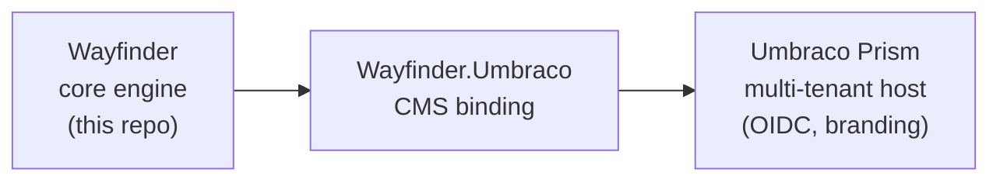

<picture>
  <source media="(prefers-color-scheme: dark)" srcset="assets/wordmark-dark.png">
  
</picture>

[](https://github.com/jonnymuir/Wayfinder/actions/workflows/ci.yml)
[](https://www.nuget.org/packages/Wayfinder)
[](https://www.nuget.org/packages/Wayfinder.Engine)
[](https://www.nuget.org/packages/Wayfinder.Editor)
[](LICENSE)

A service blueprint / service-design engine: domain model, calculation engine,
state-machine engine, and a compiled visual editor web component. Framework-agnostic, with no
Umbraco, no ASP.NET Core MVC, and no hosting assumptions baked in.

The domain model is the service blueprint as the
[Nielsen Norman Group defines it](https://www.nngroup.com/articles/service-blueprints-definition/):
a user journey laid out across customer actions, frontstage, backstage, and support processes,
divided by the lines of interaction, visibility, and internal interaction. Wayfinder makes that
model executable, and delivers journeys to
[GDS Service Standard](https://www.gov.uk/service-manual/service-standard) practice with the
real GOV.UK Design System.

Wayfinder was extracted from [Umbraco Prism](https://github.com/jonnymuir/Umbraco.Prism),
which is now a consumer of these packages rather than their owner. A host application,
Umbraco-based or otherwise, layers its own tenancy, auth, and rendering opinions on top.
[`Wayfinder.Umbraco`](https://github.com/jonnymuir/Wayfinder.Umbraco) is the Umbraco-hosted
implementation Prism itself uses.

## How it fits together



- **`Wayfinder`** (this repo) is the framework-agnostic core: the domain model, the calculation
  engine, and the state-machine engine. No Umbraco, no hosting assumptions.
- **[`Wayfinder.Umbraco`](https://github.com/jonnymuir/Wayfinder.Umbraco)** is the Umbraco host:
  a DB-backed store, Block Grid blocks, an authoring UI, and GOV.UK rendering.
- **[Umbraco Prism](https://github.com/jonnymuir/Umbraco.Prism)** is the reference consumer for
  multi-tenancy and branding — `UmbracoPrism.Core` carries no service-design opinion of its own.

## Quickstart

```bash
dotnet add package Wayfinder.Engine
```

Seed a blueprint (a JSON file — see
[`docs/guides/reference-service-blueprint-contract.md`](docs/guides/reference-service-blueprint-contract.md)
for the full schema):

```json
// blueprints/apply-for-a-licence.json
{
  "definitionKey": "apply-for-a-licence",
  "displayName": "Apply for a licence",
  "version": 1,
  "initialStage": "start",
  "requestPolicy": "single",
  "queues": [ { "key": "citizen", "displayName": "Citizen", "actor": "citizen" } ],
  "stages": [
    {
      "stageKey": "start",
      "displayName": "Your details",
      "queueKey": "citizen",
      "components": [ { "type": "text", "fieldKey": "fullName", "label": "Full name", "required": true } ],
      "routes": [ { "id": "start--submit--done", "target": "done", "trigger": "submit" } ]
    },
    { "stageKey": "done", "displayName": "Application submitted", "queueKey": "citizen", "components": [ { "type": "panel", "heading": "Application complete" } ] }
  ]
}
```

Register the engine and round-trip an instance:

```csharp
using Wayfinder.Engine.Extensions;

builder.Services.AddProcessManager("blueprints"); // folder containing the JSON above
```

```csharp
using Wayfinder.Models.ServiceDesign;

var envelope = processManager.GetCurrent(
    blueprintKey: "apply-for-a-licence", tenantId: "default", userId: "user-1",
    accessProfile: ActorProfile.UnrestrictedOwner);
// envelope.ResponseState == "render" — envelope.Render.Components has the "Your details" fields

var advanced = processManager.Advance(
    instanceId: envelope.InstanceId, tenantId: "default", userId: "user-1",
    accessProfile: ActorProfile.UnrestrictedOwner, action: "submit", expectedStateVersion: envelope.StateVersion,
    fieldValues: new Dictionary<string, object?> { ["fullName"] = "Ada Lovelace" });
// advanced.Render.StateDisplayName == "Application submitted"
```

That's the whole engine surface a host needs: `GetCurrent` to render the current step, `Advance`
to submit it. [`Wayfinder.Umbraco`](https://github.com/jonnymuir/Wayfinder.Umbraco) wraps exactly
these two calls behind a Block Grid block; see its own README for the CMS-hosted version.

## See it running

`Wayfinder.AppHost` + `Wayfinder.ReferenceApp` is a small, self-contained .NET Aspire host in
this repo, with every package wired together, real GOV.UK Design System rendering, a demo login,
and a seeded "apply for a licence to hold a juggling event" journey. It's the fastest way to
see what a working Wayfinder host actually looks like, and exactly how little wiring a real
host (like `Wayfinder.Umbraco`) collapses into. Run it with
`dotnet run --project Wayfinder.AppHost`, or the "C#: Aspire (Full Stack)" launch config in
VS Code. See [`docs/guides/reference-app.md`](docs/guides/reference-app.md) for what it
implements, how the demo blueprint is seeded from JSON and only saved in memory, and what a
real host does differently.

## Packages

**Core**

| Package | Purpose |
|---|---|
| `Wayfinder` | Core domain models (`ServiceBlueprint`, `ServiceRequestResponseEnvelope`, etc.), the declarative calculation engine, and the sanitizer interface. Zero framework dependency. |
| `Wayfinder.Engine` | The service blueprint state-machine engine: queue routing, gateway evaluation, request persistence, support-systems, bulk data. |

**Surfaces** — HTTP glue a host maps into its own pipeline

| Package | Purpose |
|---|---|
| `Wayfinder.Engine.Api` | REST toolkit (`MapServiceBlueprintAuthoringApi()`) exposing service blueprint authoring (list/read/validate/save/simulate) over HTTP for any ASP.NET Core host. |
| `Wayfinder.Engine.Mcp` | MCP-over-HTTP toolkit (`MapServiceBlueprintAuthoringMcp()`): the same authoring surface as MCP tools for AI agents. |
| `Wayfinder.Engine.Http` | Stage file-upload HTTP glue (`StageFileUploads`) and the inbound webhook support-system callback (`MapWebhookSupportSystemCallbacks`). |
| `Wayfinder.Engine.Journey` | The single-actor citizen journey surface — a minimal host wraps `GetCurrent`/`Advance` behind real routes with almost no code of its own. |
| `Wayfinder.Engine.Worklist` | The caseworker worklist surface — pickup/putback/paging over `IProcessManager.GetQueueWorkItems`, as HTTP endpoints. |

**Rendering & Editor**

| Package | Purpose |
|---|---|
| `Wayfinder.Rendering.GovUk` | Real GOV.UK Design System rendering (vendored `govuk-frontend`), the built-in component/field catalog, and calculation-driven live components. |
| `Wayfinder.Editor` | The compiled visual service-blueprint editor web component, ready to embed in a host's own admin UI. |
| `Wayfinder.Editor.Http` | The editor's host-side REST glue (load/save a blueprint from the editor's own UI). |

## The service blueprint model

Wayfinder implements the
[Nielsen Norman Group service blueprint](https://www.nngroup.com/articles/service-blueprints-definition/)
(Sarah Gibbons, 2017) as a runnable artefact. In that model a user's journey is laid out across
horizontal lanes, divided by the lines of interaction, visibility, and internal interaction.
Those lanes are a blueprint's `queues`, one for each team or system that does the work. A
`stage` is a step in the journey. Every stage sits in a queue, and the queue is what places it
in a lane, so a stage is a stage whether it happens frontstage or backstage. A `gateway` is the
route from one stage to the next, from any lane to any lane. Alongside the route a gateway
carries the declarative rules for it: whether to split or join, waiting information, and the
conditions that choose a path. Support Systems is NN/g's support-processes lane made
first-class.


*The model is the [Nielsen Norman Group service blueprint](https://www.nngroup.com/articles/service-blueprints-definition/)
(Sarah Gibbons, 2017). See the article for Gibbons' own worked example.*

A `ServiceBlueprint` describes a journey as `queues` (named work queues), `stages` (each
owning its own `routes`), and `gateways` (first-class Split/Join routing nodes that a stage's
routes always target, never another stage directly). See
[`docs/guides/reference-service-blueprint-contract.md`](docs/guides/reference-service-blueprint-contract.md)
for the full authoring schema, and
[`docs/guides/calculation-language.md`](docs/guides/calculation-language.md) for the
declarative expression language used in `calculations` and `showWhen`.

## AI-ready authoring

Service blueprint authoring is exposed to AI agents (Claude Code or any MCP client) the
same way it's exposed to a human editor: as a toolkit a host app wires into its own
pipeline. `Wayfinder.Engine.Api` and `Wayfinder.Engine.Mcp` map the same
list/read/validate/save/simulate operations as REST and MCP-over-HTTP respectively, both
calling straight into a host's live `Wayfinder.Engine` in-process. See
[`docs/guides/ai-service-blueprint-authoring.md`](docs/guides/ai-service-blueprint-authoring.md).

## Building

```bash
dotnet build Wayfinder.slnx
dotnet pack Wayfinder.slnx
```

## License

MIT. See [LICENSE](LICENSE).
