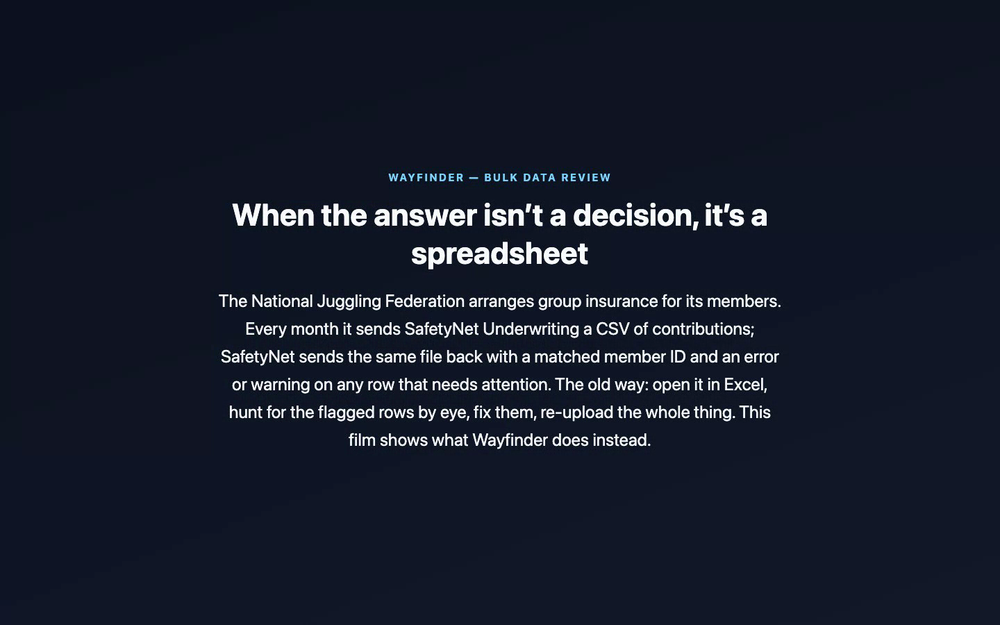
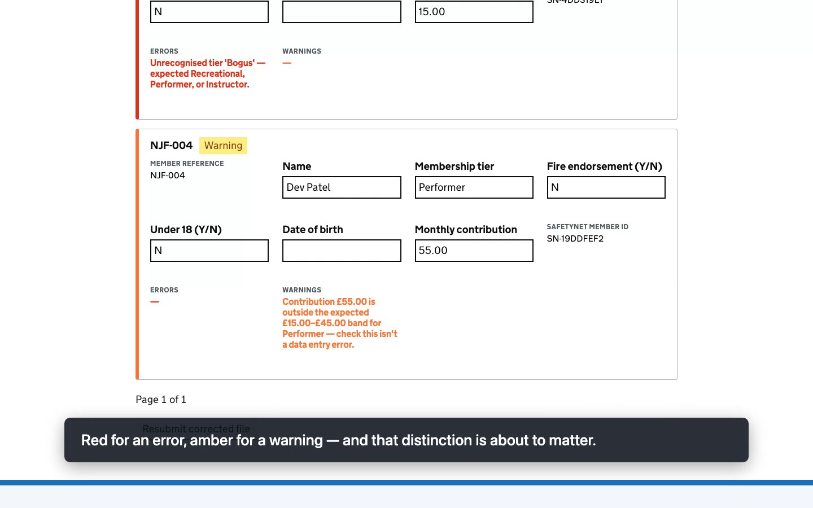
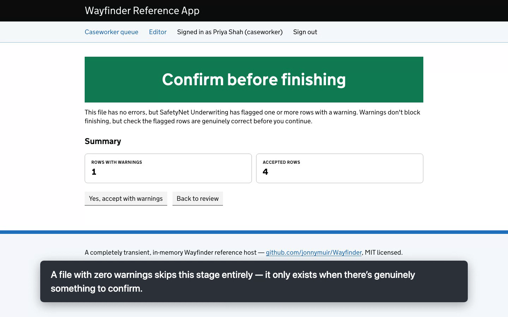
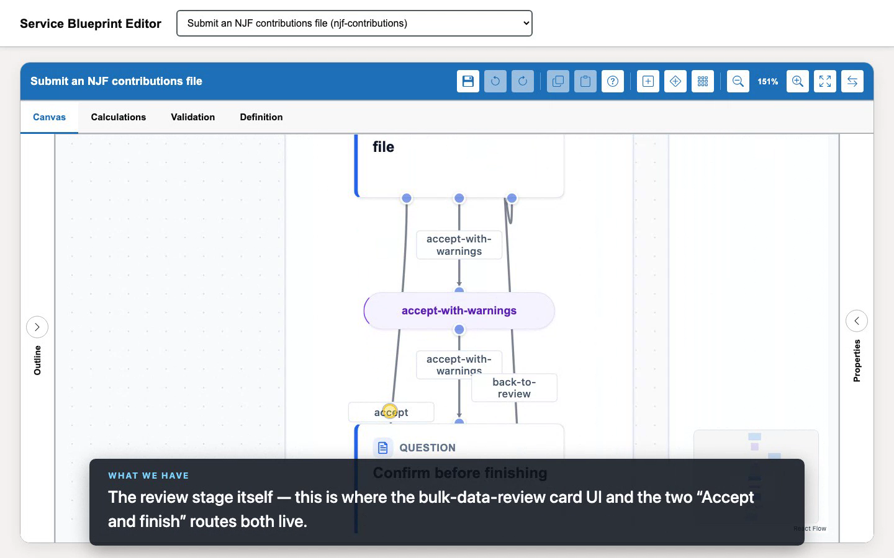
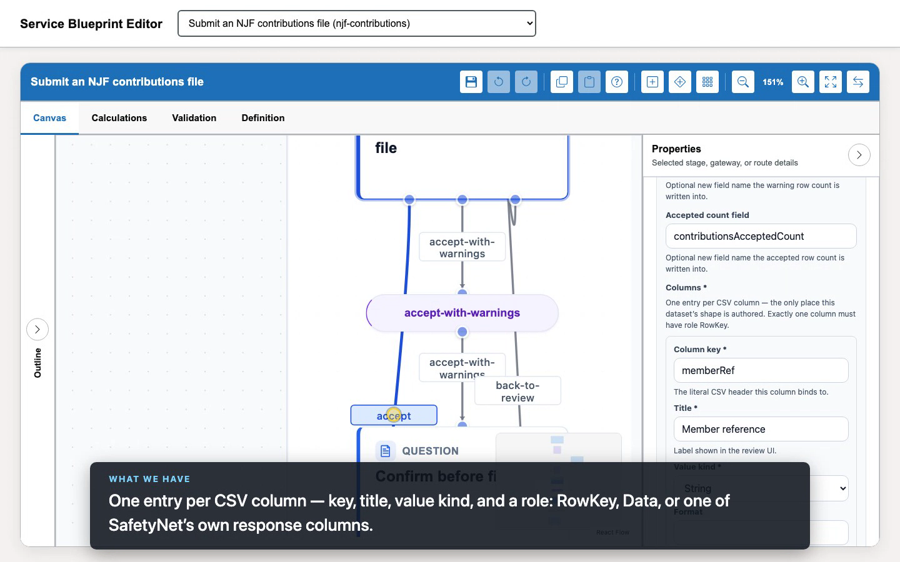

# Bulk data review — a walkthrough

A narrated companion to [`bulk-data-review.webm`](./bulk-data-review.webm) — this document mirrors
the recording beat for beat, so you can read it standalone or follow along while watching. It
covers both sides of the feature: what **Priya Shah**, an NJF operations user, actually sees and
does (Acts 1–4), and — because understanding what a feature *means* usually means seeing how it's
actually built — what the person who **designed** this service sees in the editor (Act 5): the
canvas, and the properties panel where a bulk dataset's whole shape gets authored. If you're
building on top of this feature yourself (a new blueprint, a new host), see
[docs/guides/bulk-data-review.md](../guides/bulk-data-review.md) instead — that one's the full
implementer reference this walkthrough only samples from.

## The story

The **National Juggling Federation (NJF)** arranges group public-liability insurance for its
members, through a fictional insurer called **SafetyNet Underwriting** — the same insurer from
the [overview demo](./wayfinder-overview.webm), now doing something quite different: instead of
one human underwriter making one decision on one case, it's applying automatic rules to every row
of a monthly CSV of member contributions, and handing back the same file annotated with an error
or warning on any row that needs attention.

That "same file back, annotated" contract is exactly the kind of thing that, historically, meant
someone opening the file in Excel, scrolling through looking for the flagged rows, fixing them by
hand, and re-uploading the whole thing. **Bulk data review** is Wayfinder's answer: a modern,
paginated review screen that shows you only the rows that need attention, lets you correct them
in place, and resubmits a corrected version of the *whole* file — because SafetyNet's own contract
never changes, it always expects the whole thing — without you ever touching a spreadsheet.

The person doing this isn't a licensing caseworker — it's **Priya Shah**, NJF operations staff.
Same shared backstage tool as the caseworker (the reference app deliberately runs multiple
services through one worklist — see `DemoUsers.cs`), different job entirely.

## Act 1 — submitting the file

Priya signs in and opens **Submit an NJF contributions file** — a plain GOV.UK upload page, one
file field, nothing unusual yet.



This month's file has five members. Three are completely fine. One has a genuine data problem —
a membership tier ("Bogus") that doesn't exist. One has a contribution that's unusually high for
its tier — not wrong, exactly, but worth a second look.

Priya uploads it and submits — and lands **directly on the wait screen**, the same position the
citizen (frontstage applicant) side of the toolkit has always put people on straight away, rather
than a detour through the queue list first just to click back in. If she navigates away — back to
her own worklist, say, to check on something else — the submission is still there, findable,
tagged **Waiting**, never lost from view. That's the same underlying join-gateway wait/poll
mechanism the licensing demo's own "send to insurer" step uses; it just now lands you on the
useful screen by default instead of an extra click away from it.

## Act 2 — only the rows that need attention

SafetyNet Underwriting — a genuinely separate ASP.NET app, running on its own port, that knows
nothing about Wayfinder's internals — validates the file for real and sends back the same five
rows, each with a matched member ID and (for two of them) an error or warning.



The review screen shows a summary — 1 error, 1 warning, 3 accepted — and then **only the rows that
need attention**, as cards. This is the whole point: in a real file with two thousand rows, the
other 1,998 clean ones are never sent to the browser at all. The card for Cara Delgado's row
(`NJF-003`) was fetched by the browser itself, after the page loaded, from a small REST endpoint —
not baked into the page's own HTML.

Notice, too, that there's no **Accept and finish** button anywhere on this page. That's not a
disabled button with an explanation — it simply isn't offered. One row still has a genuine error,
and the blueprint's own declared rule (`contributionsErrorCount = 0`) means that route doesn't
exist yet, the same way a route can be withheld anywhere else in Wayfinder.

## Act 3 — correcting a row, without reloading the page

Priya fixes the tier on Cara Delgado's card directly — types "Recreational" over "Bogus". There's
no "Save" button to click: the correction **autosaves**, shortly after she stops typing, and the
card's own status line tells her so ("Saved for resubmission" — not just "Saved": nothing here
validates the correction itself, only resubmitting through SafetyNet Underwriting does, and the
wording says so). That's a small request scoped to this one row; the other four rows, and the file
sitting behind them, are untouched.

This matters more than it looks: an earlier version of this screen needed an explicit save click,
which meant a second edit made right after saving once could be silently left out of the file that
gets resubmitted — materializing the corrected file always reads whatever the store last had, not
whatever happens to be sitting in the input box. Autosave alone doesn't fully close that gap
either, so every way of navigating away from the current rows — paging, filtering, or clicking any
button on the page — flushes any still-pending save first and waits for it. A correction genuinely
can't be silently dropped.

Then she clicks **Resubmit corrected file**. This sends the *whole* file back to SafetyNet
Underwriting — its contract can't change, it always wants the whole thing — but built from the
corrected dataset, not Priya's original upload. It's a genuine loop through the same two systems,
not a special-cased "try again" path: the same split gateway, the same wait screen, the same
review stage, all over again.

## Act 4 — a warning still needs an explicit yes

SafetyNet Underwriting genuinely re-validates the corrected file. Cara Delgado's row is gone — no
error left to show. Dev Patel's row is still there, still flagged, and **Accept and finish**
appears — the same `contributionsErrorCount = 0` rule from Act 2, now satisfied. Errors block;
warnings don't. SafetyNet Underwriting isn't wrong to keep flagging Dev Patel's contribution —
it's just not the kind of thing that should stop Priya finishing her month-end submission.

But clicking it doesn't finish straight away. With a warning still on record, that same button
leads somewhere new first:



An explicit **"Yes, accept with warnings"** — not a silent nod. This screen only exists because
there's genuinely something to confirm: a file with zero warnings never sees it at all, "Accept
and finish" goes straight through. There's a **"Back to review"** escape hatch too, for anyone who
sees this and wants a second look first — safe to use, since going back doesn't lose or re-fetch
anything already ingested.

Confirming lands on a plain confirmation page: **Contributions file accepted** — with the warning
still on record, exactly as it should be.

## Act 5 — none of this is hidden in host code

Everything Acts 1–4 just showed — the review stage, the two-route "Accept and finish", the
confirmation stage — is **declared**, in the same visual editor used throughout the rest of
Wayfinder, not hand-coded into some controller. Understanding what this feature *is* means seeing
this side of it too.

### The canvas



This is the whole `njf-contributions` blueprint, the same "boxes and arrows" view every other
Wayfinder service gets. The two routes both named `accept-with-warnings` in this close-up are the
two halves of the pattern Act 4 showed: from the review stage, one route goes straight to
`accept` (visible only once every count is genuinely zero) and one goes to a small
**"Confirm before finishing"** stage instead (visible only once there's an error-free file with a
warning still on it) — both sharing the same on-screen label, "Accept and finish", so Priya only
ever sees one button regardless of which path is actually live. Nothing about this needed a change
to Wayfinder's own engine — it's two ordinary routes, gated by two ordinary, mutually exclusive
conditions, the same declarative mechanism every route in every Wayfinder blueprint already uses.

### The properties panel

Selecting the review stage opens its own properties panel, and scrolling down reaches the one
action that does the real work here — **"Ingest a bulk dataset"**:



This is the single place a bulk dataset's *shape* gets authored — one entry per CSV column, each
with a key (the literal CSV header it binds to), a title (what the review card shows), a value
kind, and a **role**: `RowKey` (the column SafetyNet is expected to echo back unchanged, used to
match a row across resubmission rounds — every dataset needs exactly one), `Data` (an ordinary
business value, optionally editable, like the membership tier Priya corrected in Act 3),
`ResponseMatchedId` (an identifier SafetyNet assigned, always read-only), or `ResponseError`/
`ResponseWarning` (what actually drives which rows show up as "needing attention" at all). Beyond
this list, the review card UI on the other end needs no configuration of its own — it just renders
whatever this declares. Add a column here, and it shows up in the review cards; there's no second
place to keep in sync.

## Try it yourself

```
dotnet run --project Wayfinder.AppHost
```

Sign in as `njf-operations@example.test` / `wayfinder-demo`, and look for **Submit an NJF
contributions file** on the home page (not the caseworker queue — that's where you land straight
after signing in). Upload
[`samples/njf-contributions-sample.csv`](./samples/njf-contributions-sample.csv) — the exact file
the recording uses, five rows, with Cara Delgado's bad tier and Dev Patel's out-of-band
contribution already in it, ready to walk through Acts 2–4 above. Any CSV with the header
`memberRef,memberName,tier,fireEndorsement,under18,dob,monthlyContribution` will do more broadly;
see `SafetyNetUnderwriting/ContributionsValidation.cs` for the actual rules being applied
(duplicate/missing member references, unrecognised tiers, a fire-endorsement surcharge floor,
under-18/date-of-birth consistency, and the contribution-band warning shown above).

To see Act 5's own screens yourself: sign in as any caseworker-role user, open **Editor**, choose
**Submit an NJF contributions file (njf-contributions)** from the blueprint selector, and select
the "Review contributions file" stage.

## Regenerating the recording

```
cd Wayfinder.ReferenceApp.Tests && npm run demo:record:bulk-data-review
```

Produces `docs/demos/bulk-data-review.webm` and prints a narration timeline (every caption with
its video-relative timestamp) to the console — see
[docs/demos/README.md](./README.md#conventions) for the recording conventions this follows, and
`tests/demo/bulk-data-review-demo.spec.ts` for the actual assertions behind every claim this
document and the recording both make.
