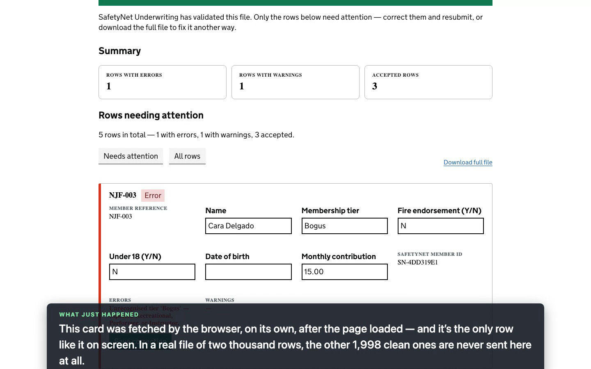
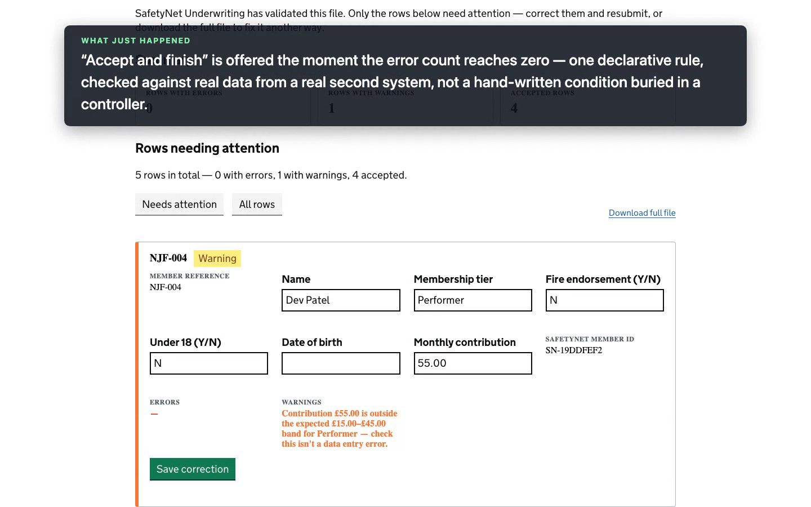

# Bulk data review — a walkthrough

A narrated companion to [`bulk-data-review.webm`](./bulk-data-review.webm) — this document mirrors
the recording beat for beat, so you can read it standalone or follow along while watching. If
you're building on top of this feature (a new blueprint, a new host), see
[docs/guides/bulk-data-review.md](../guides/bulk-data-review.md) instead — that one's for
implementers; this one's for anyone who wants to understand what the feature actually does and
why, starting from zero.

## The story

The **National Juggling Federation (NJF)** arranges group public-liability insurance for its
members, through a fictional insurer called **SafetyNet Underwriting** — the same insurer from
the [overview demo](./wayfinder-overview.webm), now doing something quite different: instead of
one human underwriter making one decision on one case, it's applying automatic rules to every row
of a monthly CSV of member contributions, and handing back the same file annotated with an error
or warning on any row that needs attention.

That "same file back, annotated" contract is exactly the kind of thing that, historically, meant
someone opening the file in Excel, scrolling through looking for the flagged rows, fixing them by
hand, and re-uploading the whole thing. **Bulk data review** is Wayfinder's answer: a modern,
paginated review screen that shows you only the rows that need attention, lets you correct them
in place, and resubmits a corrected version of the *whole* file — because SafetyNet's own contract
never changes, it always expects the whole thing — without you ever touching a spreadsheet.

The person doing this isn't a licensing caseworker — it's **Priya Shah**, NJF operations staff.
Same shared backstage tool as the caseworker (the reference app deliberately runs multiple
services through one worklist — see `DemoUsers.cs`), different job entirely.

## Act 1 — submitting the file

Priya signs in and opens **Submit an NJF contributions file** — a plain GOV.UK upload page, one
file field, nothing unusual yet.


This month's file has five members. Three are completely fine. One has a genuine data problem —
a membership tier ("Bogus") that doesn't exist. One has a contribution that's unusually high for
its tier — not wrong, exactly, but worth a second look.

Priya uploads it and submits. Wayfinder sends her straight back to her worklist, where the
submission sits tagged **Waiting** — visible and findable, not vanished, while SafetyNet
Underwriting works on it in the background. This is the exact same pattern the licensing demo
uses for its own "send to insurer" step: a join-gateway wait, with a poll-driven screen that
updates itself once the answer arrives.

## Act 2 — only the rows that need attention

SafetyNet Underwriting — a genuinely separate ASP.NET app, running on its own port, that knows
nothing about Wayfinder's internals — validates the file for real and sends back the same five
rows, each with a matched member ID and (for two of them) an error or warning.



The review screen shows a summary — 1 error, 1 warning, 3 accepted — and then **only the rows that
need attention**, as cards. This is the whole point: in a real file with two thousand rows, the
other 1,998 clean ones are never sent to the browser at all. The card for Cara Delgado's row
(`NJF-003`) was fetched by the browser itself, after the page loaded, from a small REST endpoint —
not baked into the page's own HTML.

Notice, too, that there's no **Accept and finish** button anywhere on this page. That's not a
disabled button with an explanation — it simply isn't offered. One row still has a genuine error,
and the blueprint's own declared rule (`contributionsErrorCount = 0`) means that route doesn't
exist yet, the same way a route can be withheld anywhere else in Wayfinder.

## Act 3 — correcting a row, without reloading the page

Priya fixes the tier on Cara Delgado's card directly — types "Recreational" over "Bogus" — and
clicks **Save correction**. That's a single small request scoped to this one row; the other four
rows, and the file sitting behind them, are untouched.

Then she clicks **Resubmit corrected file**. This sends the *whole* file back to SafetyNet
Underwriting — its contract can't change, it always wants the whole thing — but built from the
corrected dataset, not Priya's original upload. It's a genuine loop through the same two systems,
not a special-cased "try again" path: the same split gateway, the same wait screen, the same
review stage, all over again.

## Act 4 — clean enough to finish, warning and all

SafetyNet Underwriting genuinely re-validates the corrected file. Cara Delgado's row is gone —
no error left to show. Dev Patel's row is still there, still flagged:



And this is the detail worth sitting with: **Accept and finish** is visible now, even with a
warning still outstanding. Errors block; warnings don't. That's not a UI nicety — it's the same
`contributionsErrorCount = 0` rule from Act 2, now satisfied, evaluated against real data a real
second system produced. SafetyNet Underwriting isn't wrong to keep flagging Dev Patel's
contribution — it's just not the kind of thing that should stop Priya finishing her month-end
submission.

Priya clicks it, and lands on a plain confirmation page: **Contributions file accepted** — with
the warning still on record, exactly as it should be.

## Try it yourself

```
dotnet run --project Wayfinder.AppHost
```

Sign in as `njf-operations@example.test` / `wayfinder-demo`, and look for **Submit an NJF
contributions file** on the home page (not the caseworker queue — that's where you land straight
after signing in). Upload
[`samples/njf-contributions-sample.csv`](./samples/njf-contributions-sample.csv) — the exact file
the recording uses, five rows, with Cara Delgado's bad tier and Dev Patel's out-of-band
contribution already in it, ready to walk through Acts 2–4 above. Any CSV with the header
`memberRef,memberName,tier,fireEndorsement,under18,dob,monthlyContribution` will do more broadly;
see `SafetyNetUnderwriting/ContributionsValidation.cs` for the actual rules being applied
(duplicate/missing member references, unrecognised tiers, a fire-endorsement surcharge floor,
under-18/date-of-birth consistency, and the contribution-band warning shown above).

## Regenerating the recording

```
cd Wayfinder.ReferenceApp.Tests && npm run demo:record:bulk-data-review
```

Produces `docs/demos/bulk-data-review.webm` and prints a narration timeline (every caption with
its video-relative timestamp) to the console — see
[docs/demos/README.md](./README.md#conventions) for the recording conventions this follows, and
`tests/demo/bulk-data-review-demo.spec.ts` for the actual assertions behind every claim this
document and the recording both make.
