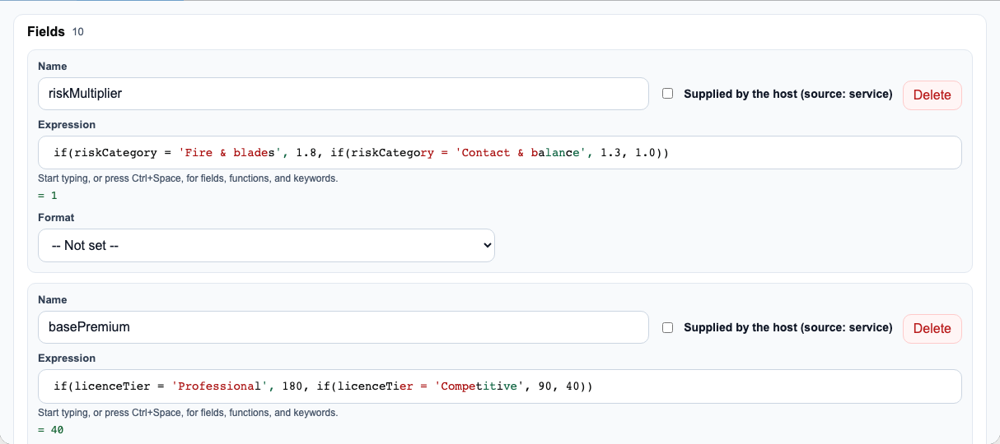
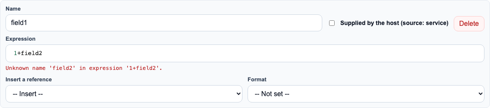
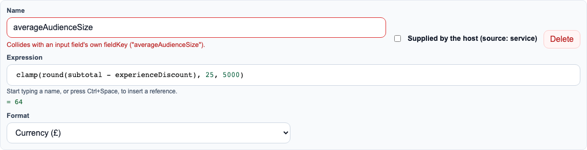
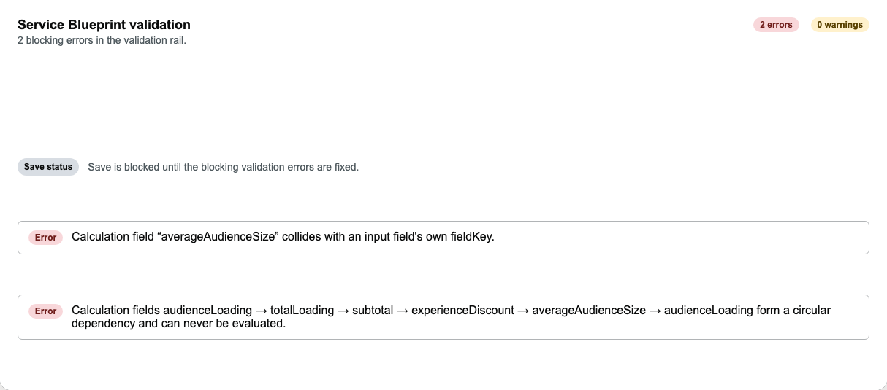
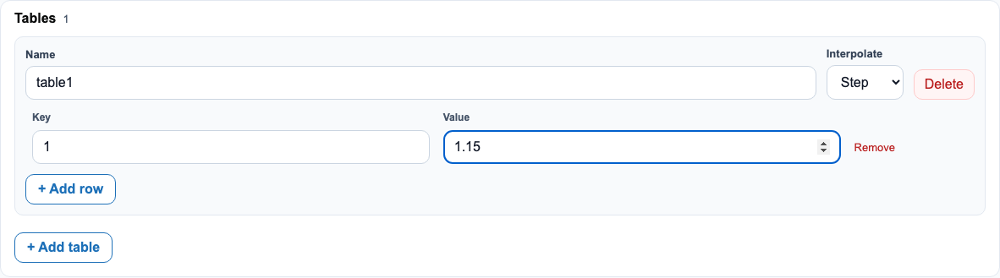
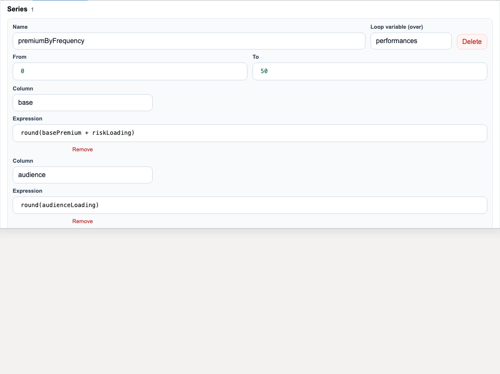

# The Calculations tab

## Overview

The Calculations tab is the visual authoring surface for a service blueprint's
`calculations` block (`fields`/`tables`/`series`, the declarative expression language
documented in full at
[`docs/guides/calculation-language.md`](../../guides/calculation-language.md)). It writes
the exact same JSON shape an MCP-driven agent would produce by calling
`validate_service_blueprint`/`simulate_service_blueprint` directly, there is no separate
model. Before this tab existed, `calculations` could only be hand-edited as raw JSON in
the Definition tab.

## Walkthrough

### Fields, in real declaration order, with a live computed value

Every field is listed in the order it actually evaluates in, each with a syntax-highlighted
expression editor and its live computed value shown underneath (evaluated against every
input's own declared `default`, the same scope `validate_service_blueprint`'s own static
check uses):



### Fields must be declared before they're referenced: handled automatically

A field referencing another field that isn't declared yet is a hard error at evaluation
time. Rather than asking the designer to maintain declaration order by hand, editing an
expression recomputes a stable topological order automatically, a field only ever moves
when a real dependency forces it:



*(This particular field references `field2`, which hasn't been given an expression yet,
the live preview correctly reports it as unresolved, exactly the feedback you'd get from
`validate_service_blueprint`.)*

A genuine circular dependency can't be ordered at all, and is reported by name rather than
silently producing something broken:


### A field name can't collide with an input it will actually collide with

A calculation field name is checked against every input's own `fieldKey`, but **only**
inputs that have a declared `default`, because
`CalculationScopeBuilder.Build` (the server-side engine) never puts an input with neither a
submission nor a default into the calc scope in the first place. A summary-list row that
legitimately reuses a calc field's own name to display it (the standard check-your-answers
pattern) is never flagged; a real collision is:



### The Validation tab shares the same checks and blocks Save

Every check above, plus unknown references, unknown `lookup()` tables, and series
loop-variable collisions, is computed once (`calculation-diagnostics.ts`) and shared by
this tab, the Definition-tab lint, and the Validation tab. A real calculation error
proactively disables the Save button, exactly mirroring what the server would reject the
save for anyway, not just an error message after a failed attempt:



### Tables

A lookup table (`interpolate: "linear" | "step"`, a numeric key→value map for `lookup()`)
is edited the same way, add a table, add rows, edit interpolation:



### Series

A `series` produces a row per step of a loop variable (`over`, bounded by `from`/`to`),
each row's columns their own expressions, the loop variable is itself in scope inside
every column expression, shown here in the real `juggling-insurance-modeller` seed's
`premiumByFrequency` series (`over: "performances"`):



### Saving

The toolbar Save control lives inside the Canvas tab's own slotted content (true of every
tab-specific control in this shell, not just Calculations), switch to Canvas to save:


## For agents

- Root element: `<wayfinder-calculations-editor>`, reachable via the `Calculations` tab
  button (`page.getByRole('tab', { name: 'Calculations' })`).
- Each field/table/series row carries a stable data attribute keyed by name:
  `[data-wayfinder-calc-field="<name>"]`, `[data-wayfinder-calc-table="<name>"]`,
  `[data-wayfinder-calc-series="<name>"]`, never rely on row index, since rows reorder.
  A field's live preview value is `[data-wayfinder-calc-field-preview]` inside its row.
- Renaming a field/table/series, or editing an expression, commits on the input's
  `change` event / the CodeMirror editor's own `expression-input` CustomEvent, not on
  every keystroke into a plain text box.
- **Live reorder while typing**: as soon as a partially-typed expression contains a
  complete, valid reference to a field declared later, the field's row moves immediately,
  mid-keystroke. If you're driving this via Playwright/automation and building an
  expression incrementally, type the identifier that triggers the reorder **last**, or the
  DOM move can reset the editor's cursor and scramble whatever you type afterward.
- Like every other authoring surface, this tab writes/reads the exact
  `ServiceBlueprintCalculationsBlock` JSON shape, see
  [`docs/guides/calculation-language.md`](../../guides/calculation-language.md) for the
  full grammar and [`docs/guides/reference-service-blueprint-contract.md`](../../guides/reference-service-blueprint-contract.md)
  for where it sits in the blueprint. To validate or simulate a blueprint's calculations
  programmatically rather than through this UI, use the `validate_service_blueprint` /
  `simulate_service_blueprint` MCP tools (or the equivalent REST authoring endpoints),
  documented in [`docs/guides/ai-service-blueprint-authoring.md`](../../guides/ai-service-blueprint-authoring.md).

## Keeping this current

Every screenshot above is written by
`Wayfinder.ReferenceApp.Tests/tests/calculations-editor.spec.ts` (against the real
`juggling-insurance-modeller` seed blueprint), regenerate with:

```
cd Wayfinder.ReferenceApp.Tests && npm run docs:screenshots
```
