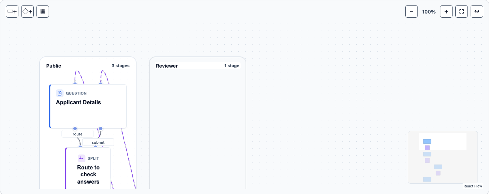
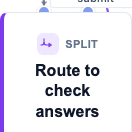
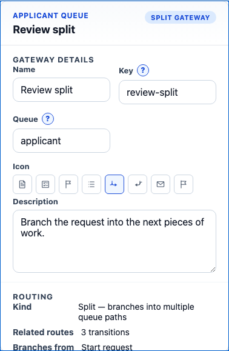
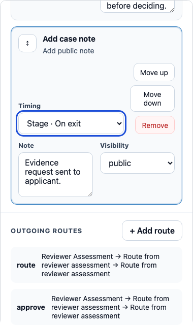

# The Canvas tab

## Overview

The Canvas tab is the primary editing surface — where the editor opens by default, and
where the toolbar (Save/Undo/Redo, per every other tab's own doc in this series) actually
lives. It has two parts: the **graph** itself (a React Flow canvas rendering `queues` as
lane columns, `stages` and `gateways` as nodes, and `routes` as edges between them — see
[`docs/guides/reference-service-blueprint-contract.md`](../../guides/reference-service-blueprint-contract.md)
for what those actually are in the model), and the **properties panel**
(`<wayfinder-step-inspector>`) that opens alongside it when a stage, gateway, or component
is selected.

## Walkthrough

### The graph: lanes, stages, routes

Each queue is its own lane column; a stage shows its shell kind (Question, CheckAnswers,
…) and name; routes between nodes carry their trigger label:



### Gateways

A Split routes to more than one place, a Join merges routes back together — both render as
a distinct node kind on the graph, separate from a stage, with their own icon and label:



*(A single-route Split specifically renders as a compact pill rather than this fuller
card — not pictured here, since neither fixture used for this doc's screenshots happens to
contain one; see `[data-wayfinder-gateway-shape]` below.)*

### The properties panel

Selecting anything opens `<wayfinder-step-inspector>` alongside the graph. For a gateway,
that's its name/key/queue/icon/description plus its routing summary:



For a stage, the same panel edits its actions — pick an action type, fill in its real
parameters (forms-backed fields validate as you go), reorder or remove:



Some property fields are **reference-aware** rather than free text — `conditionalOn`
offers a dropdown of the current stage's own sibling field keys, `defaultFrom` offers the
blueprint's declared calculation field names, `changeStateKey` offers real stage keys —
removing an entire class of typo-driven dangling-reference errors at the source. (Not
pictured in this doc's own screenshots — see
[`docs/skills/calculations-editor/SKILL.md`](../calculations-editor/SKILL.md) for
`defaultFrom` specifically, since it reads from the same calculation field list that tab
authors.)

## For agents

- The graph custom element: `<wayfinder-service-blueprint-graph>`, ready once it carries
  `data-wayfinder-graph-ready="true"` (an empty blueprint renders `[data-wayfinder-empty-state]`
  instead and never sets this).
- A lane: `[data-wayfinder-role-queue]` / `[data-wayfinder-queue-container]`. A stage node:
  `[data-wayfinder-stage="<key>"]` (also `[data-wayfinder-stage-card]` on its outer shell).
  A gateway node: `[data-wayfinder-gateway="<key>"]` (outer shell
  `[data-wayfinder-gateway-node]`), with `data-wayfinder-gateway-kind="Split"|"Join"` and
  `data-wayfinder-gateway-shape="pill"|"diamond"` (a pill only for a single-route Split;
  everything else, including every Join, is the fuller `"diamond"` form). A route edge:
  `[data-wayfinder-route-path]` (`data-wayfinder-route-from`/`-to` name the endpoints);
  `[data-wayfinder-transition]` for the transition/route label itself.
- Select something with a click, or focus + `Enter` for keyboard-only selection; a
  selected gateway/stage gets `aria-pressed="true"`.
- The properties panel: `<wayfinder-step-inspector>`, with
  `[data-wayfinder-inspector-kind]="stage"|"gateway"|"component"` and
  `[data-wayfinder-inspector-heading]` for what's currently selected.
  `[data-wayfinder-field="<name>"]` for a gateway's own read-only summary fields. For stage
  actions specifically: `[data-wayfinder-open-action-picker]` +
  `[data-wayfinder-action-picker-option="<action-type>"]` +
  `[data-wayfinder-action-picker-add]` to add one, `[data-wayfinder-action-param="<index>-<paramName>"]`
  for each parameter, `[data-wayfinder-stage-action="<index>"]` per configured action.
- The toolbar (Save/Undo/Redo) lives inside this tab's own slotted content — hidden while
  any other tab is active. Every other tab's own doc in this series notes this same thing;
  it's this tab you have to be on to actually click Save.

## Keeping this current

Every screenshot above is written by one of three existing Storybook-driven specs in
`Wayfinder.Editor.Client/tests/service-blueprint-editor/`:
`service-blueprint-graph-visual.spec.ts` (graph overview, gateway shape),
`service-blueprint-editor-gateways.spec.ts` (gateway inspector), and
`stage-action-editor.spec.ts` (stage action editor). Regenerate with:

```
cd Wayfinder.Editor.Client && CAPTURE_DOC_SCREENSHOTS=1 npx playwright test service-blueprint-graph-visual.spec.ts service-blueprint-editor-gateways.spec.ts stage-action-editor.spec.ts
```
