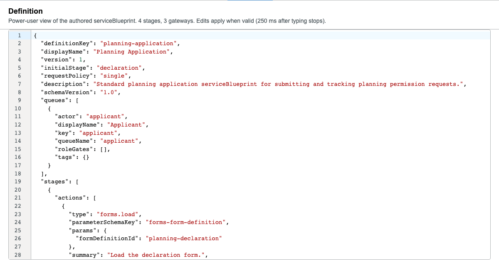
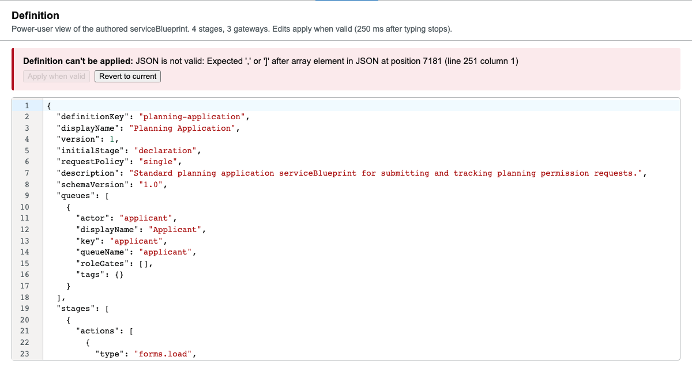
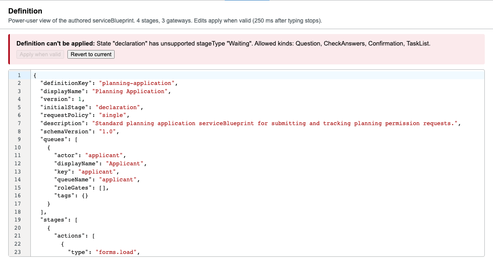

# The Definition tab

## Overview

The Definition tab (`wayfinder-definition-editor.ts`) is a CodeMirror-based JSON editor
showing the exact same `AuthoredServiceBlueprint` document every visual tab reads and
writes, there is no separate "export" format. Anything the visual tabs don't yet expose
can be hand-edited here directly. An edit only takes effect once it's genuinely valid: it's
parsed, schema-checked, and cross-referenced (250ms after typing stops) before "Apply when
valid" is even enabled, an invalid or unsafe edit never silently reaches the live
blueprint.

## Walkthrough

### The current blueprint, as JSON

Switching to Definition shows the live document, syntax-highlighted, with line numbers:



### Invalid JSON is caught before it can be applied

A syntax error is reported with the exact position, and "Apply when valid" stays disabled,
the visual tabs keep showing the last-valid blueprint, never a half-applied broken one:



### Structurally valid JSON can still be rejected

Valid JSON that violates the schema, here, a retired `stageType` value, is caught the
same way, naming exactly what's wrong and what's actually allowed:



The same live linting covers everything the visual tabs check as you author (a
`conditionalOn`/`defaultFrom`/`changeStateKey` pointing nowhere, an unknown component
type), and, via the same `calculation-diagnostics.ts` the Calculations tab and the
Validation tab share, every `calculations` problem too (a bad expression, an unknown
reference, a field-name collision, a circular dependency). See
[`docs/skills/calculations-editor/SKILL.md`](../calculations-editor/SKILL.md) for what
those checks are; this tab doesn't re-list them, it just applies the same ones to
hand-edited JSON.

## For agents

- Root panel: `[data-wayfinder-definition-panel]`; the editor itself is
  `[data-wayfinder-definition-editor]`, a `<wayfinder-definition-editor>` custom element
  whose own shadow root contains the real CodeMirror instance (`.cm-content`,
  `.cm-scroller`, `.cm-lineNumbers`, `.cm-search` for the Cmd/Ctrl+F search panel).
- `[data-wayfinder-definition-banner]`, the parse/schema error banner (absent when the
  current text is valid). `[data-wayfinder-definition-apply]` is a native `disabled`
  button while invalid. `[data-wayfinder-definition-announcement]` reports a successful
  apply.
- This tab's own tests (`service-blueprint-editor-definition-tab.spec.ts`) drive it two
  ways worth knowing: setting `.value` directly on the `wayfinder-definition-editor`
  element and dispatching a `definition-input` CustomEvent (reliable for scripting a full
  document replacement), versus focusing `.cm-content` and using real keyboard input (for
  testing the editor's own UX, search, select-all, wheel scroll). Prefer the former for
  anything that isn't specifically testing CodeMirror interaction itself.
- **This is arguably the most direct surface for an agent that already has the full JSON**
  and wants to paste/verify it in a human-visible UI, but for a fully-scripted workflow
  with no human in the loop at all, `validate_service_blueprint` and a direct REST
  PUT/`simulate_service_blueprint` call are the better fit (no browser, no debounce, a
  structured diagnostic list instead of one banner at a time). See
  [`docs/guides/ai-service-blueprint-authoring.md`](../../guides/ai-service-blueprint-authoring.md).

## Keeping this current

All three screenshots above are written by
`Wayfinder.Editor.Client/tests/service-blueprint-editor/service-blueprint-editor-definition-tab.spec.ts`
(a Storybook-driven spec, Storybook is started automatically by this project's Playwright
config). Regenerate with:

```
cd Wayfinder.Editor.Client && CAPTURE_DOC_SCREENSHOTS=1 npx playwright test service-blueprint-editor-definition-tab.spec.ts
```
