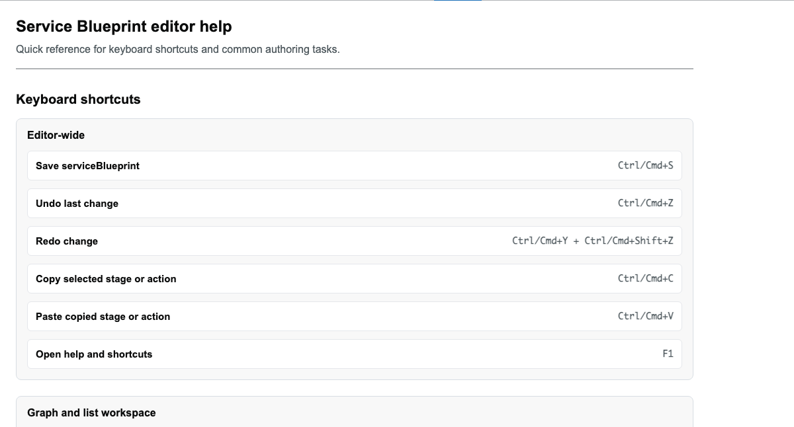

# The Help tab

## Overview

The Help tab (`<wayfinder-help-panel>`) is static reference content: the same keyboard
shortcuts also reachable via the toolbar's help button / F1 (they're driven from the one
shared `SERVICE_BLUEPRINT_SHORTCUT_GROUPS` list, so the two can't drift apart), a short list
of quick tips about how the canvas/queues/gateways read, and a numbered getting-started
guide for building a service blueprint from nothing. It's simplest of the seven tabs — no
props, no events, nothing to configure.

## Walkthrough

Switch to Help for the shortcut reference, quick tips, and getting-started guide:



## For agents

There's genuinely nothing to drive here beyond confirming the tab opens — it's read-only,
static content with no data attributes of its own (`wayfinder-help-panel` as a tag selector
is enough to target it). If you need the shortcut list specifically, read
`SERVICE_BLUEPRINT_SHORTCUT_GROUPS` in `Wayfinder.Editor.Client/src/service-blueprint-editor/editor-shortcuts.ts`
directly rather than parsing this tab's rendered output — it's the same source data.

Don't confuse this tab with the **keyboard-shortcut dialog** (`[data-wayfinder-shortcut-dialog]`,
opened by the toolbar's `[data-wayfinder-help]` button or the F1 key) — a separate, modal
surface reading from the same shortcut list, available from any tab. Most of
`service-blueprint-editor-help.spec.ts` (despite the filename) tests that dialog, not this
tab.

## Keeping this current

The screenshot above is written by
`Wayfinder.Editor.Client/tests/service-blueprint-editor/service-blueprint-editor-help.spec.ts`
(a Storybook-driven spec — Storybook is started automatically by this project's Playwright
config). Regenerate with:

```
cd Wayfinder.Editor.Client && CAPTURE_DOC_SCREENSHOTS=1 npx playwright test service-blueprint-editor-help.spec.ts
```
