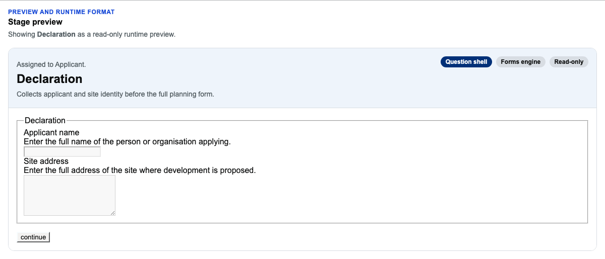

# The Preview tab

## Overview

The Preview tab (`<wayfinder-stage-preview>`, rendered by `_renderStagePreview()` in
`wayfinder-service-blueprint-editor.ts`) shows a selected stage exactly as an applicant or
caseworker would actually see it — the real runtime projection
(`service-request-runtime-projection.ts` turns an `AuthoredStage`'s components into the
same projected component shapes the live journey renders), not a mockup or a second
rendering implementation. Every field is disabled and every action button is disabled — it's
read-only by design, a way to check a stage looks right without stepping through the whole
citizen/caseworker journey to reach it.

## Walkthrough

Select a stage on the Canvas, switch to Preview, and see its real GOV.UK-styled output —
the stage's shell type, its form-engine/read-only badges, who it's assigned to, and every
field and action exactly as authored:



## For agents

- Root element: `[data-wayfinder-stage-preview]`, reachable via the `Preview` tab button
  (`page.getByRole('tab', { name: 'Preview' })`) after a stage is selected on the Canvas.
- `[data-wayfinder-preview-stage-name]` — the stage's display name.
- `[data-wayfinder-preview-shell]` — the shell type (e.g. "Question shell").
- `[data-wayfinder-preview-readonly]` — the read-only indicator; every real GOV.UK input
  (`.govuk-input`, `.govuk-textarea`, etc.) and `[data-wayfinder-preview-action="continue"]`
  are genuinely `disabled`, not just visually greyed out.
- `[data-wayfinder-preview-assignment]` — who the stage is assigned to (role gates, or the
  stage's own `actor`), in plain language.
- `[data-wayfinder-preview-selector]` — present only when there's more than one variant to
  choose between (absent for a plain single-path stage).
- This is a read-only view — there's no write-side contract to document here. For the
  authoring shape a stage/component is actually projected from, see
  [`docs/guides/reference-service-blueprint-contract.md`](../../guides/reference-service-blueprint-contract.md).

## Keeping this current

The screenshot above is written by
`Wayfinder.Editor.Client/tests/service-blueprint-editor/service-blueprint-editor-stage-preview.spec.ts`
(a Storybook-driven spec — Storybook is started automatically by this project's Playwright
config). Regenerate with:

```
cd Wayfinder.Editor.Client && CAPTURE_DOC_SCREENSHOTS=1 npx playwright test service-blueprint-editor-stage-preview.spec.ts
```
