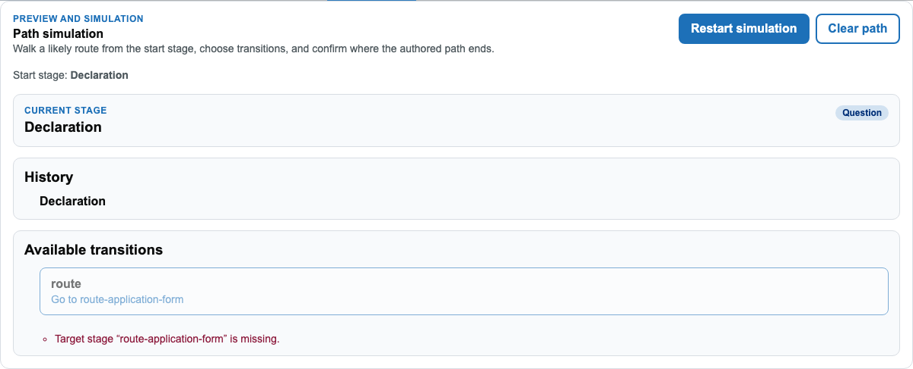

# The Simulation tab

## Overview

The Simulation tab (`<wayfinder-service-blueprint-simulation>`) is the one editor surface
that actually **runs** something, rather than statically checking or rendering it. Starting
a simulation walks a real hypothetical instance through the blueprint's own state machine
from its initial stage, offering only the transitions genuinely available from the current
stage — the same routing/gateway logic a live request goes through, not a separate
approximation.

This is a different kind of confidence check from the other tabs:

- **Preview** renders one stage's look, read-only — it never executes anything.
- **Validation** checks structure and calculations statically, without a real instance.
- **Simulation** actually advances a hypothetical instance step by step and shows where
  it can legitimately go, including surfacing a broken route (a transition pointing at a
  missing stage) as an inline error rather than letting you click into a dead end.

## Walkthrough

Switch to Simulation and start one — the current stage, the path taken so far, and every
transition actually available from here are shown together. A transition that can't
resolve (here, a route pointing at a stage that no longer exists in this particular story's
fixture) is disabled and explained inline, not silently unavailable:



From here, clicking an available transition advances the instance and repeats — current
stage, history, and available transitions all update to match, until the path reaches a
terminal stage or one that's waiting on something external.

## For agents

- Root panel: `[data-wayfinder-simulation-panel]`, reachable via the `Simulation` tab
  button (`page.getByRole('tab', { name: 'Simulation' })`) — like every other tab in this
  shell, its content isn't visible until the tab itself is selected.
- `[data-wayfinder-simulation-start]` — starts a new run from the blueprint's initial
  stage. `[data-wayfinder-simulation-initial-stage]` / `[data-wayfinder-simulation-current-stage]`
  report the start and current stage names; `[data-wayfinder-simulation-history]` lists the
  path taken so far.
- `[data-wayfinder-simulation-transition="<index>"]` — an available transition button, in
  the order shown. A transition that can't currently resolve is a native `disabled` button,
  with the reason in `[data-wayfinder-simulation-blocker="<index>"]`.
- `[data-wayfinder-stage="<key>"]` gains `data-wayfinder-stage-simulation-current="true"`
  on the graph node matching the current stage, and a completed transition edge gains
  `data-wayfinder-transition-simulation-path="true"` — the Canvas graph highlights the
  walked path live alongside this panel.
- A run stops at `[data-wayfinder-simulation-stop-reason="terminal"]` (reached an end
  stage) or `[data-wayfinder-simulation-stop-reason="waiting"]` (reached a stage waiting on
  something external, e.g. a queue handoff).
- The same capability this tab drives is available directly, without any UI, via the
  `simulate_service_blueprint` MCP tool / REST authoring endpoint — see
  [`docs/guides/ai-service-blueprint-authoring.md`](../../guides/ai-service-blueprint-authoring.md).
  That's the better fit for an agent scripting a full walkthrough; this tab is for a human
  confirming the same thing visually.
- **Known gap**: the multi-transition walkthrough (advancing through several stages in one
  run, a rejection branch, a genuinely blocked/waiting stage) has three tests in
  `service-blueprint-editor-simulation.spec.ts` still marked `test.fixme` — confirmed live
  while building this doc that they don't currently pass even with the missing
  Simulation-tab-activation step added; the transition buttons stay disabled because the
  planning-service-blueprint story's own fixture data references a target stage
  (`route-application-form`) that isn't actually part of that story. Re-certifying those
  three scenarios needs the story's fixture data fixed (or the tests pointed at a story
  that doesn't have this gap) — out of scope for this doc, which only covers the "start a
  simulation" state that does work today.

## Keeping this current

The screenshot above is written by
`Wayfinder.Editor.Client/tests/service-blueprint-editor/service-blueprint-editor-simulation.spec.ts`
(a Storybook-driven spec — Storybook is started automatically by this project's Playwright
config). Regenerate with:

```
cd Wayfinder.Editor.Client && CAPTURE_DOC_SCREENSHOTS=1 npx playwright test service-blueprint-editor-simulation.spec.ts
```
