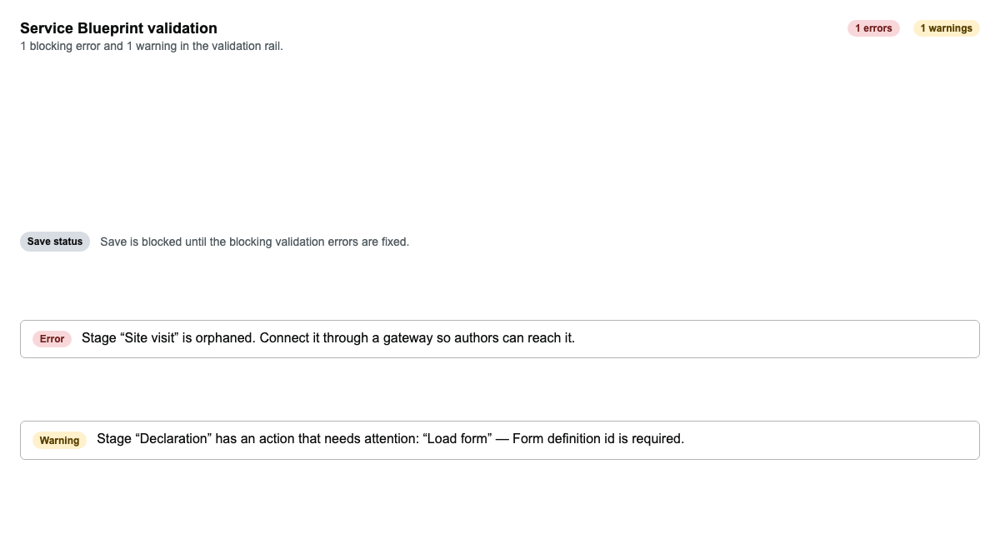
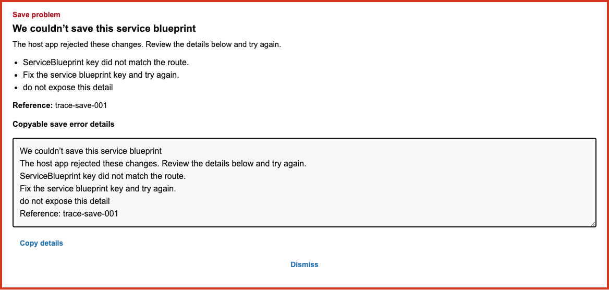

# The Validation tab

## Overview

The Validation tab is `service-blueprint-validation.ts`'s `validateServiceBlueprint()`,
the single client-side check that decides whether the Save button is actually clickable.
It covers structural problems (an orphaned or unreachable stage, a dead-end stage, a
duplicate or dangling route, a misconfigured stage/route action) and, since the
calculation-validation unification, every `calculations` problem too (a bad expression, an
unknown reference, a field-name collision, a circular dependency), computed once via the
shared `computeCalculationDiagnostics` (`calculation-diagnostics.ts`) so this tab, the
Calculations tab's own inline checks, and the Definition-tab lint can never disagree with
each other about what's wrong.

Each issue has a severity: **blocking** errors disable Save outright (a native `disabled`
button, not just a warning message); non-blocking warnings are shown but don't stop a
save. This is what proactively tells you a save will fail *before* you try it, the same
class of failure the server's own `SaveAsync` → `Validate()` would otherwise only report
after a rejected request.

## Walkthrough

### The issue list

Every issue is listed with its severity badge and a plain-language message, plus a running
error/warning count and whether Save is currently blocked:



Clicking an issue jumps straight to what it's about, a stage's detail panel, a route, an
action's own field, or (for a calculation issue) the Calculations tab.

### A failed save is reported in plain language, not a stack trace

If a save is attempted and the host rejects it, the raw exception detail is kept out of the
surfaced message, only the structured, safe-to-show summary, detail lines, and a reference
ID are shown, with a "Copy details" affordance for a support handoff:



## For agents

- The issue list container: `[data-wayfinder-validation-rail]`, present in the DOM (and
  assertable via `toContainText`) even while a different tab is active, but only actually
  **visible** (and therefore screenshot-able) once the `Validation` tab itself is selected.
- Each issue: `[data-wayfinder-validation-issue]`, some carrying a stable id suffix (e.g.
  `[data-wayfinder-validation-issue="stage-unreachable-site-visit"]`, or a substring match
  like `[data-wayfinder-validation-issue*="declaration-action-0-formDefinitionId"]` for
  action-scoped issues), click one to navigate to its location.
- Save gating: `[data-wayfinder-save]` is a native `disabled` button while any blocking
  issue exists, check `toBeDisabled()`/`toBeEnabled()` directly rather than trying to
  click and catch an error.
- A failed save surfaces at `[data-wayfinder-save-error]` (title/summary/detail lines,
  `[data-wayfinder-save-error-details]` for the full copyable text,
  `[data-wayfinder-copy-save-error]` / `[data-wayfinder-dismiss-save-error]` to act on it),
  and `[data-wayfinder-save-status]` for the current one-line status. A successful save also
  raises a `[data-wayfinder-toast]`.
- Every calculation-specific issue this tab can show comes from the same
  `computeCalculationDiagnostics` used by the Calculations tab, see
  [`docs/skills/calculations-editor/SKILL.md`](../calculations-editor/SKILL.md) for what
  triggers each one. This doc doesn't re-list them.

## Keeping this current

Both screenshots above are written by
`Wayfinder.Editor.Client/tests/service-blueprint-editor/service-blueprint-editor-validation.spec.ts`
(a Storybook-driven spec, Storybook is started automatically by this project's Playwright
config). Regenerate with:

```
cd Wayfinder.Editor.Client && CAPTURE_DOC_SCREENSHOTS=1 npx playwright test service-blueprint-editor-validation.spec.ts
```
